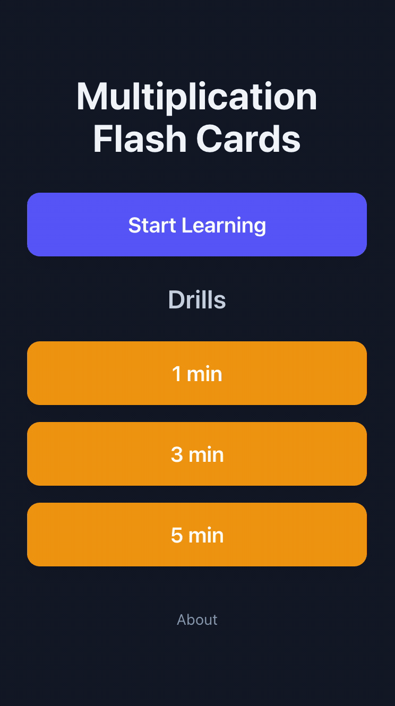

# Multiplication Flash Cards

[**Play Now**](https://jonathan-beebe.github.io/multiplication-flash-cards/)

A math flash card app to help 1st–5th graders practice addition, subtraction, multiplication, and division.

It began as a simple tool to help my fourth-grade son practice his multiplication facts (times tables). After gaining popularity with his school and classmates, it has grown into a comprehensive resource for elementary students to strengthen their math skills at every level.

## Install as an App

You can install this as an app on your device for easy access — no app store needed.

### iPhone or iPad

1. Open the link above in **Safari**
2. Tap the **Share** button (square with an arrow pointing up)
3. Scroll down and tap **Add to Home Screen**
4. Tap **Add**

### Android

1. Open the link above in **Chrome**
2. Tap the **three-dot menu** in the top right
3. Tap **Add to Home Screen** or **Install App**
4. Tap **Add**

### Desktop (Chrome, Edge)

1. Open the link above in your browser
2. Look for the **install icon** in the address bar (a computer with a down arrow), or click the three-dot menu and choose **Install Multiplication Flash Cards**
3. Click **Install**

Once installed, the app will appear on your home screen or in your apps list, and works offline.

---

If you have any comments, bug reports, or feature requests, please email me at jonathan-beebe@outlook.com.
