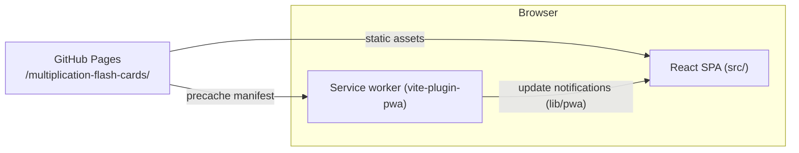
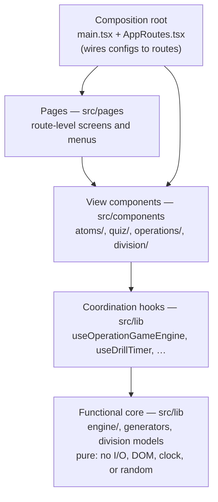
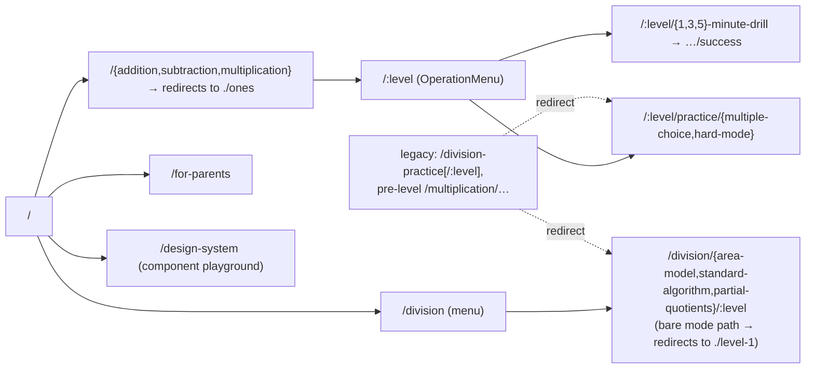

# Architecture

A math training PWA for grade-school children. This doc is the canon for how the
code is organized: the system's shape, the layers and their dependency rules,
and the route map. Check changes against it; update it in the same change that
alters any shape it draws (new feature folder, new route family, new layer
rule).

## System shape

What are the deployables and what does the system touch? One static deployable —
there is no server and no remote data store; all state is in-memory per session.

## Layers

Which layer may import which? Dependencies point inward, only inward — a lower
layer never knows a higher layer exists. `src/lib` never imports from
`src/components` or `src/pages`.

Rules that bind:

- **The core is pure.** `engine/gameEngine`, the question generators, and the
  division models (`division/divisionProblem`, `longDivision`, `areaModelState`,
  `problemState`) are pure functions and types. Time, randomness, and ids are
  injected (`GameEngineDeps`), never read directly. Core tests need no mocks of
  the outside world.
- **Hooks are the coordination layer.** The hooks in `src/lib` are thin: they
  hold React state and delegate every decision to a core function. If a hook or
  component grows an `if` about the domain, extract it into the core.
- **One-way data flow.** Event → pure state transition (core) → render. Level
  selection lives in the URL; game state lives in the engine hook; components
  receive both read-only.
- **The view is replaceable.** Rendering is I/O; components never own domain
  logic. `lib/pwa` is the one non-DOM adapter (service-worker updates).
- **Vendored libraries.** `lib/sand` is a vendored copy of the sand-effect
  playground's number display (see `lib/sand/README.md`): a pure layout/
  kinematics core plus its own imperative shell (three.js + DOM renderer). It is
  the second sanctioned adapter exception in `lib`. It never imports app code;
  only `components/sand/` may import it. It loads exclusively through
  `React.lazy` so three.js stays out of the entry chunk.

## Feature pattern: config-driven screens

The two feature families are each one generic implementation configured per
variant. Adding a variant means writing a config (plus a generator or problem
component) and wiring it in `AppRoutes` — the deletability test: removing a
variant deletes its config/folder and its route lines, nothing else.

- **Operations** (`components/operations/`): `OperationConfig` (name, route
  base, color, generator factory, question renderer) drives `OperationMenu`,
  `OperationPractice`, `OperationHardModePractice`, and `OperationDrill`.
  Configs: `additionConfig`, `subtractionConfig`, `multiplicationConfig`.
- **Division modes** (`components/division/`): `DivisionPracticePage` (shared
  shell + URL level picker) hosts one problem component per mode (`areaMode/`,
  `standardAlgorithm/`, `partialQuotients/`), all built on the shared
  `lib/division/divisionProblem` model.

## Route map

Where does every URL land? Operations share one route shape; division modes
share another. Legacy routes exist only as redirects for published PWA bookmarks
— never link to them.

One URL flag exists outside the route map: `#sand` in the hash at load enables
the sand-particle flashcard experiment on multiple-choice practice
(`lib/featureFlags`, read once — session-sticky because in-app navigations drop
the hash).

## Where new code belongs

- A pure calculation, state transition, or generator → `src/lib` (core), with
  unit tests beside it.
- React state glue around core logic → a thin hook in `src/lib`.
- A visual element → `src/components` (reusable primitives in `atoms/`,
  quiz-board pieces in `quiz/`, feature-specific pieces in that feature's
  folder); showcase it on `/design-system`.
- A route-level screen → `src/pages`, wired in `AppRoutes.tsx`.
- A new quiz operation → an `OperationConfig` + generator; a new division mode →
  a problem component + thin page on `DivisionPracticePage`.
- End-to-end protection for a user flow → `src/integration/`.
