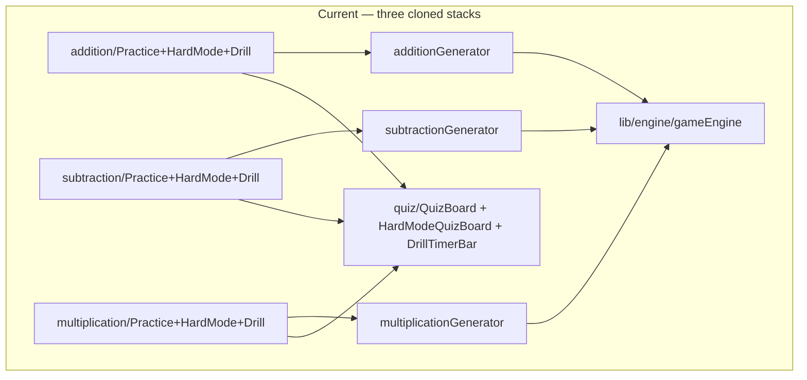
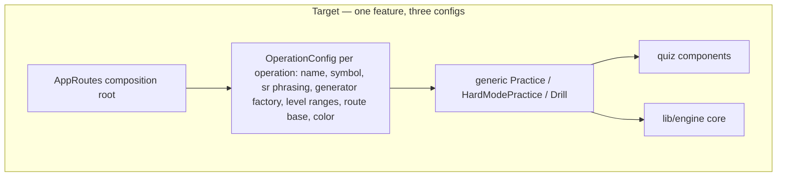

# ARCH-001: unify per-operation quiz feature behind one operation config

## Problem

The three quiz-style operations are implemented as parallel, near-identical
stacks. `src/components/addition/{Practice,HardModePractice,Drill}.tsx` and
`src/components/subtraction/{Practice,HardModePractice,Drill}.tsx` are
line-for-line clones except for the operation symbol, screen-reader phrasing,
generator import, page title, and route prefix (verified by diff);
multiplication carries the same trio in an older shape. Each operation also has
a ~6-line hook wrapper (`useAdditionGameEngine` / `useSubtractionGameEngine` /
`useMultiplicationGameEngine`) and a generator that re-implements the same
choice-generation offsets and Fisher-Yates shuffle. `DrillComplete` is used by
every operation's drill-success route (`AppRoutes.tsx:71-98`) yet lives in
`components/multiplication/`. Any shared behavior change must be applied in
triplicate.

## Goal

One operation-agnostic quiz feature that each operation merely configures, so
shared behavior has exactly one home.

## Outcome

Adding or changing a quiz-style operation touches only that operation's
config/generator and the composition root; all existing routes render identical
behavior (the integration suite passes unchanged); no practice/hard-mode/drill
component or engine hook exists in triplicate; `DrillComplete` is owned by the
shared quiz feature rather than multiplication.

## Why it matters

The repo's own history shows the cost of this duplication — BUG-003 and BUG-009
fixed the same timer bug at multiple cloned sites, and the RFCTR-002 draft
exists because "the repetition is the bug." Duplication also lets patterns
drift: multiplication has already diverged (unprefixed `Question` type,
module-level singleton generator, no levels).

## Discovery notes

Current vs target shape:

Advisory only: an `OperationConfig` object consumed by generic components is
one shape; the maker chooses the exact contract and folder placement (a
feature-first folder such as an `operations/` or `features/` module would also
make the deletability test pass — today each operation is smeared across
`components/`, `lib/`, and `AppRoutes`). The duplicated choice-offset +
shuffle logic in the three generators is a candidate for the shared engine
core. Multiplication's missing levels are deliberately NOT in scope here —
that product gap is filed separately as a feature; this ticket only ensures
the unified shape can host it.

## Related work

- [[RFCTR-002]] (draft — same repetition-is-the-bug motif)
- [[BUG-003]], [[BUG-009]] — same timer bug fixed at multiple cloned sites
- [[BUG-008]] — level ranges
- `src/lib/engine/` (`gameEngine.ts`, `useOperationGameEngine.ts`,
  `operationLevels.ts`) — the core extraction is done; this ticket finishes the
  job at the component layer
